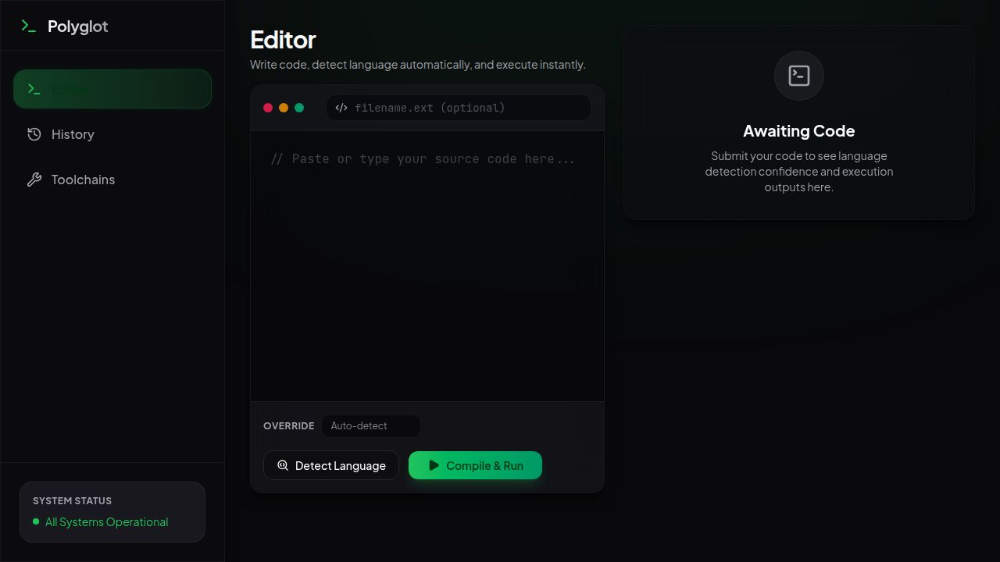

# Polyglot ⚡

Polyglot is a sleek, modern code editor and execution environment that lives in your browser. Paste code, auto-detect the language, and run it instantly across a wide array of programming languages. It features a powerful AI assistant powered by Claude 3.7 Sonnet to help you generate, explain, debug, and optimize your code on the fly!



## Features

- **Instant Execution**: Run Python, JavaScript, TypeScript, Go, Rust, C, C++, Java, Kotlin, Ruby, Swift, Haskell, and more in an isolated container environment.
- **Auto-Detection**: Don't know what language a snippet is? Polyglot will automatically detect the language for you using advanced heuristics.
- **AI Code Assistant**: Use the built-in AI panel to ask questions about your code, find bugs, or generate entire components from scratch using the `Ctrl+Enter` Generate Code modal.
- **Beautiful Dark Mode**: A meticulously designed dark-mode interface with glassmorphism elements, syntax highlighting, and high-contrast controls.
- **Code Sharing**: Generate a unique share link to easily send snippets to friends and colleagues.
- **Cloud Projects**: Sign in to save your code snippets to your personal library and access them from anywhere.

## Project Structure

This is a pnpm workspace monorepo consisting of:
- `artifacts/polyglot`: The frontend React application built with Vite and TailwindCSS.
- `artifacts/api-server`: The Express.js backend that handles execution, database interactions, and OpenRouter AI streaming.
- `lib/`: Shared libraries, database schemas (Drizzle ORM), and Zod validation schemas.
- `scripts/`: Various utility and build scripts.

## Getting Started Locally

### Prerequisites
- [Node.js](https://nodejs.org/) (v20 or v22 recommended)
- [pnpm](https://pnpm.io/)
- Docker (optional, if you want to test the full production build locally)

### Setup

1. Install dependencies:
   ```bash
   pnpm install
   ```
2. Start the development servers:
   ```bash
   pnpm --filter @workspace/api-server run dev
   pnpm --filter @workspace/polyglot run dev
   ```
3. Open `http://localhost:5173` in your browser.

## Deployment

Polyglot is containerized using Docker and is configured for seamless deployment on platforms like Render. The single `Dockerfile` at the root compiles both the frontend and backend, serving them from a single Node.js Express instance in production.

## Tech Stack
- **Frontend**: React, TypeScript, Vite, Tailwind CSS, Framer Motion, Radix UI.
- **Backend**: Node.js, Express, Drizzle ORM.
- **AI Integration**: OpenRouter (Claude 3.7 Sonnet, Gemini, GPT-4o).
- **Tooling**: pnpm workspaces, esbuild, tsc.

## License
MIT
